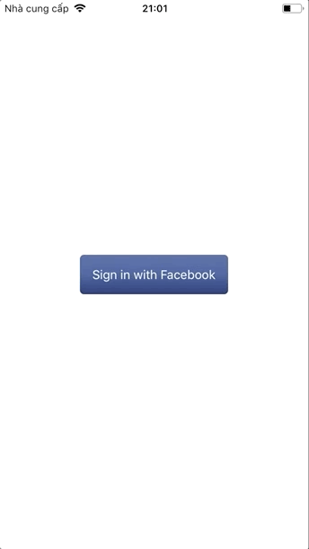
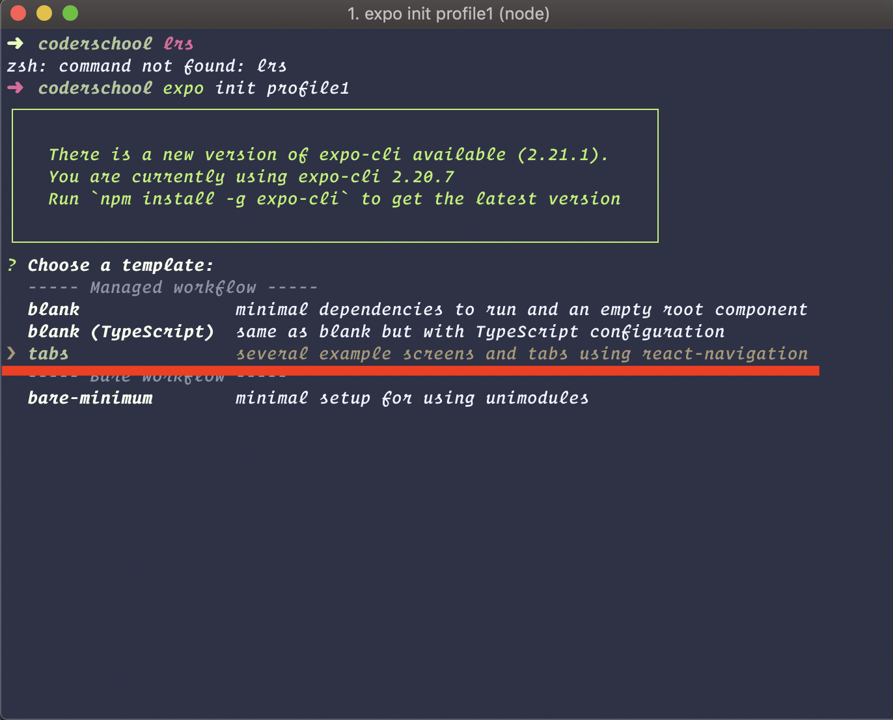
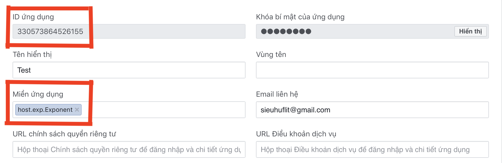
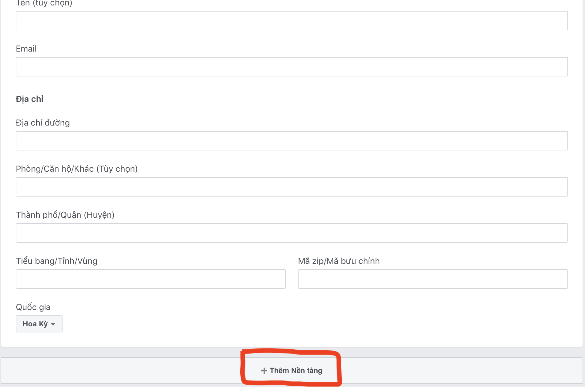
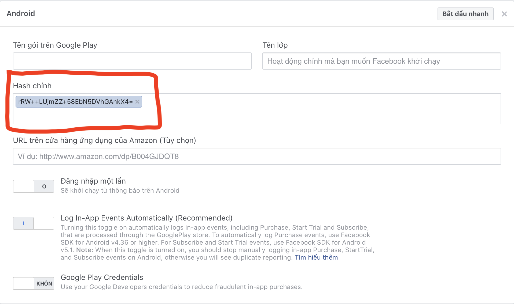
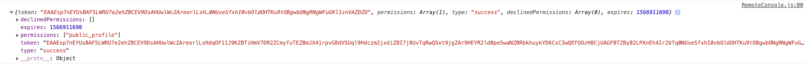
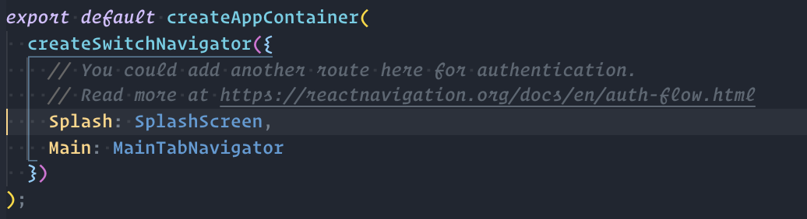
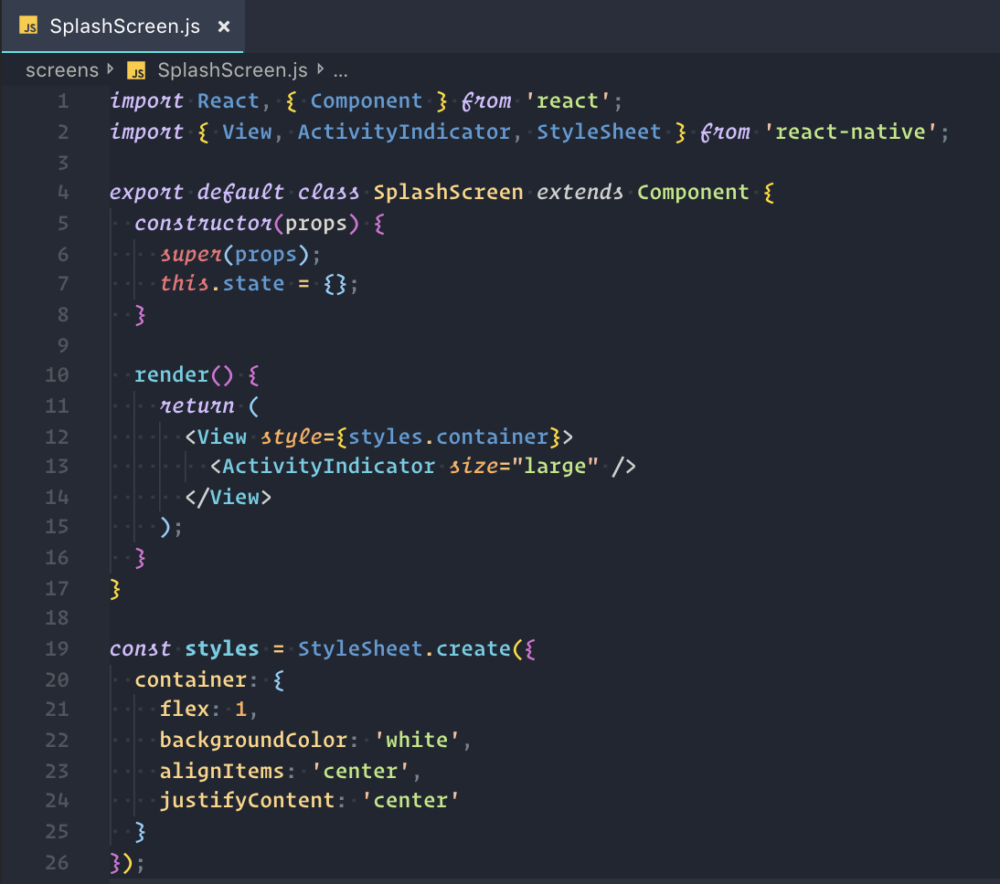
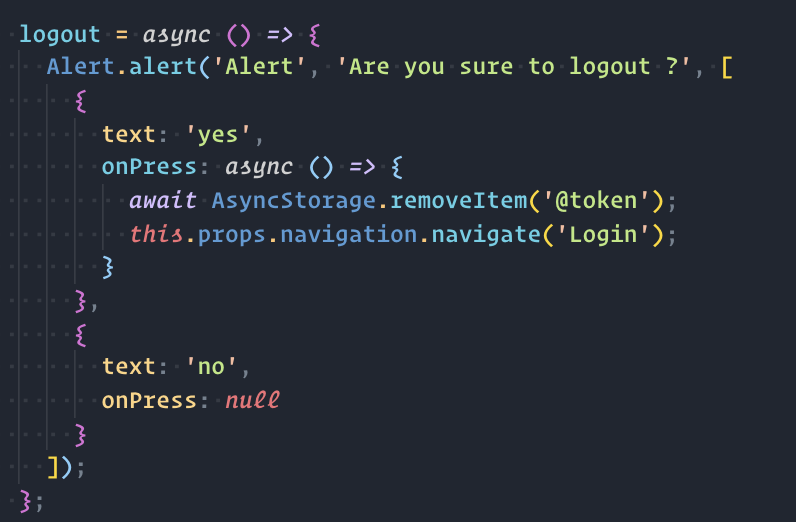

# Week 6 - **Authentication Facebook 🔑**

## Introduction 🌟

Let's build a authentication with facebook using [React Native](https://facebook.github.io/react-native/) & [Expo](https://expo.io/). Our app will continue authentication with facebook.

### What is the final result



### Features 🏆

- [ ] Create tab navigator
- [ ] Create login screen
- [ ] Create `Sign In By Facebook` button
- [ ] Sign In with facebook and get `token`
- [ ] Save facebook token with AsyncStorage
- [ ] Add the splash screen and check for auto login when have `facebook token`
- [ ] Logout and remove `token` in AsyncStorage

### Learning Objectives ✍️📚📝 ️

1. Learn how to layout with Flexbox [Read](https://facebook.github.io/react-native/docs/flexbox)

### **Milestone 1 🛣🏃 Init project**

Init project with Tab navigation options



- Follow this tips : [Facebook login](https://docs.expo.io/versions/latest/sdk/facebook/)

- Create project on facebook app





### **Milestone 2 🛣🏃Create Login Screen**

- Create a simple login screen

- Then create a gradient color `Facebook Login Button` [LinearGradient](https://docs.expo.io/versions/latest/sdk/linear-gradient/#__next)

### **Milestone 2 🛣🏃Try to Facebook Login**

- Try to login using :

```
import * as Facebook from 'expo-facebook';

login = async () => {
  const response = Facebook.logInWithReadPermissionsAsync(appId, {
    permissions: ['public_profile']
  });
  console.log(response);
  console.log(response.token);
}
```

Make sure you see the something like this in `Debug JS`



Try to make sure `token` display to the console and make sure it work;

### **Milestone 3 🛣🏃Save token to use later**

[Async Storage](https://facebook.github.io/react-native/docs/asyncstorage)

- AsyncStorage : What is this ? `AsyncStorage` is a simple, unencrypted, asynchronous, persistent, key-value storage system that is global to the app. It should be used instead of LocalStorage.

setItem : Save token as a `key` name and save the `value`.

```
await AsyncStorage.setItem('@token', token);
```

### **Milestone 4 🛣🏃Time to navigate to Home**

After login success, we have token => Go navigate to home screen

```
this.props.navigation.navigate('Home');
```

### **Milestone 5 🛣🏃Splash screen**

First your SplashScreen to the MainStack



- Then Create your `SplashScreen`



- Then we want to check if the user already have `token`, we navigate to the `Main` screen. If don't have any token, we navigate them to `Login` screen

```
componentDidMount = async () => {
  const token = await AsyncStorage.getItem('@token');
  if (token && token !== '') {
    this.props.navigation.navigate('Main');
  } else {
    this.props.navigation.navigate('Login');
  }
};
```

### **Milestone 6 🛣🏃Logout**

- Update UI in `SettingScreen` and add `Logout` button
- Make sure you try to remove `token` in `AsyncStorage` when logout


